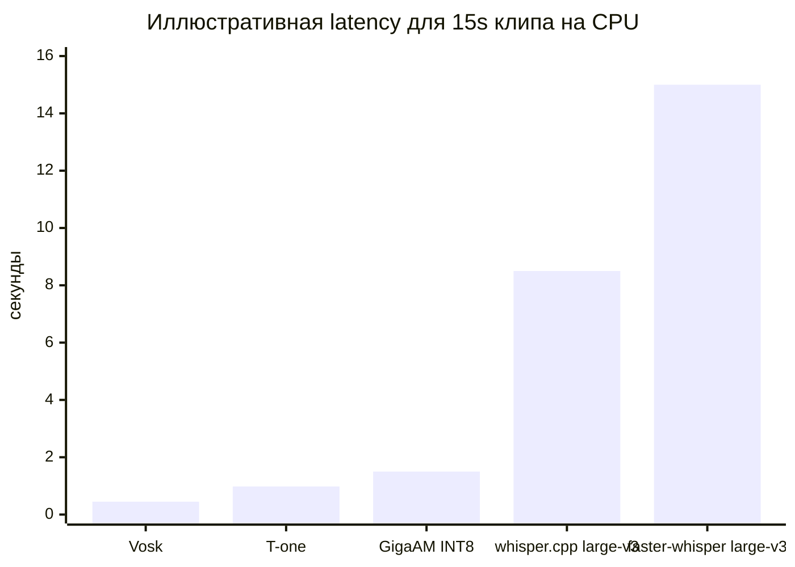
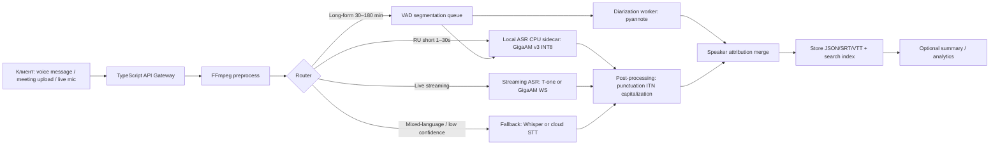

# Локальный ASR для TypeScript-сервера без GPU

## Executive summary

Для сервера без GPU и с 4–8 ГБ RAM лучший общий компромисс для **русскоязычных голосовых сообщений и встреч** сейчас выглядит так: **GigaAM v3 как базовая модель качества**, но не в “голом” PyTorch-виде, а через **ONNX/INT8-рантайм** или готовый локальный серверный обёрточный слой; для **минимальной задержки и дешёвого стриминга** — **T-one** или **Vosk**; для **многоязычия и смешанной речи** — **Whisper** как fallback, а не как основной русский движок на CPU. Это следует из того, что GigaAM v3 показывает лучшую открыто опубликованную точность на русских benchmark’ах против Whisper-large-v3, T-one оптимизирован именно под low-latency streaming и телефонию, а Vosk остаётся самым лёгким и быстрым “операционным” вариантом; при этом Whisper остаётся сильным многоязычным baseline, но на CPU и при 4–8 ГБ RAM его русская стоимость по latency обычно выше, чем у русскоязычных специализированных моделей. citeturn7view0turn8view5turn35view4turn10view1turn36view4turn38view0turn39view1

Если нужен **один практический выбор по умолчанию**, я бы рекомендовал такой стек: **Node/TypeScript API → FFmpeg preprocessing → локальный ASR sidecar → VAD/segmentation → post-processing → optional diarization**. Для short-form голосовых сообщений лучше всего подходит **GigaAM v3 RNNT/E2E в ONNX INT8-исполнении**; для long-form записей встреч — тот же GigaAM, но уже с внешним VAD и diarization, либо **T-one/Vosk для streaming-first сценариев**. Если в аудио часто встречаются английские фрагменты, иностранные имена и code-switching, стоит добавить **второй проход через Whisper** или облачный fallback. У самих GigaAM v3 и T-one в первичных источниках нет опубликованного RU-EN code-switch WER, тогда как Whisper официально позиционируется как мультиязычная модель. citeturn9view4turn28view0turn35view4turn36view4

Для вашей аппаратной рамки особенно важно, что **официальный GigaAM repo сам по себе не публикует удобных CPU-only production benchmark’ов**, а также прямо указывает, что `.transcribe()` применим только к аудио **до 25 секунд**, а long-form делается через `.transcribe_longform()` и дополнительные зависимости `pyannote.audio`. Поэтому для продакшена на CPU важнее не только “какая модель”, но и **какой runtime/serving-слой** вы выбираете. citeturn9view4turn9view0

Короткий вывод по режимам такой. Для **low-latency**: T-one или GigaAM v3 в INT8 sidecar. Для **best-quality RU offline/batch**: GigaAM v3. Для **ultra-light CPU и максимальной простоты**: Vosk. Для **multilingual fallback**: Whisper small/medium или quantized large/turbo, но уже как запасной маршрут, а не основной русский pipeline. citeturn35view4turn39view1turn10view1turn36view4turn38view0

## Практический шорт-лист моделей

Ниже я сознательно сравниваю не только “чистые чекпойнты”, но и **реально разворачиваемые CPU-конфигурации**. Для сервера важны не только параметры модели, но и runtime: ONNX Runtime, CTranslate2, ggml/whisper.cpp, Kaldi/Vosk server, собственный streaming state manager. В таблице задержка для 15-секундного клипа либо взята из опубликованного benchmark’а, либо пересчитана из RTF по формуле `latency ≈ RTF × 15 s`; в таких местах я явно помечаю значение как ожидаемое, а не гарантированное. citeturn39view1turn36view2turn28view1

| Model name | Size | RAM on load | CPU cores needed | Expected latency for 15s clip | WER RU | Quantization support | License | Notes |
|---|---:|---:|---:|---:|---|---|---|---|
| **GigaAM v3 official family** | ~220–240M params | официально не опубликовано | 4–8 | официальных CPU benchmark’ов нет | public open-datasets: **CTC 3.0 / RNNT 2.6**; Golos Farfield **4.5 / 3.9**; average on new domains **9.2 / 8.4** vs Whisper **25.1** | ONNX export officially supported | MIT | Базовая русская SoTA-линейка; E2E-версии сразу выдают пунктуацию и нормализацию; `.transcribe()` — до 25 с, long-form через pyannote. citeturn8view5turn8view0turn9view0turn9view4 |
| **GigaAM v3 RNNT INT8 via gigastt** | ~225 MB INT8; исходный вес ~850 MB | ~400 MB single / ~790 MB pool-2 | 2–4 | ~1.5 s warm; first partial ~0.78 s | clean **3.55**, far-field **4.08**, phone **18.50**, YouTube **10.91** | INT8 ONNX | MIT | Самый практичный CPU-sidecar из изученных: WS + REST + SSE, word timings, confidence, Prometheus metrics. Цифры — из единого community harness на Apple M1 CPU. citeturn39view1turn39view2 |
| **GigaAM v3 ONNX INT8 community export** | 305 MB encoder + 3.2 MB decoder + 1.4 MB joint | официально не указано; practically lightweight enough for 4–8 GB | 2–4 | ~0.32–0.45 s для 12 s clip в опубликованном demo; для 15 s ориентир ~0.4–0.6 s | CER ~4.9%; прямой публичный WER RU для этой сборки не опубликован | INT8 ONNX | MIT | Хороший инженерный путь, если нужен контроль над runtime; punctuation можно восстанавливать через Silero TE. Источник не указывает CPU-модель, поэтому latency — ориентир, а не SLA. citeturn28view1 |
| **T-one 71M** | 71M params; ~138 MB without LM | ~672 MB greedy; beam+LM требует значительно больше диска | 2–4 | ~1.0 s by RTF≈0.065 | call-center **8.63**; OpenSTT calls relabeled **7.94**; CommonVoice 19 **5.32** | ONNX; KenLM beam search | Apache-2.0 | Streaming-first модель для 300 ms chunks; word timestamps in real-time; Docker/Triton deployment examples. Beam+LM повышает качество, но LM у community-harness весит ~5.5 GB, что плохо для compact-сервера. citeturn35view4turn35view0turn35view1turn39view1 |
| **Vosk server bundle** | ~966 MB in community bundle; official RU models range from 45M to 1.8G | ~560 MB in community harness | 1–2 | ~0.45 s by RTF≈0.03 | clean **2.97**, far-field **6.29**, phone **22.74**, YouTube **17.24**; official `ru-0.42` gives Golos crowd **4.4** | dynamic graph / LM variations; not the same as generic INT8 ONNX | Apache-2.0 | Самый дешёвый по latency/CPU вариант из practical bundle comparison; поддерживает WebSocket/gRPC/WebRTC. Но для “больших” server-моделей Vosk сам предупреждает, что отдельные carpa-конфигурации могут требовать ~16 GB RAM и выше. citeturn39view1turn37view0turn37view1turn10view1 |
| **whisper.cpp large-v3** | 2.9 GiB disk | ~3.9 GB | 4–8 | ~5.4–11.6 s by RTF≈0.36–0.77 | clean **15.26**, far-field **17.91**, phone **32.73**, YouTube **22.61** | integer quantization in ggml; OpenVINO support | MIT | Работает локально и широко переносим, но как основной RU-движок на CPU уступает GigaAM/T-one/Vosk по latency и часто по качеству. Зато полезен как multilingual fallback. citeturn38view0turn39view1 |
| **faster-whisper large-v3 / turbo** | 2.9 GB large-v3; ~1.6 GB turbo in community harness | ~2619 MB large-v3; ~2154 MB turbo | 8 | **>15 s** for 15s clip on community CPU harness; official small-int8 benchmark on i7-12700K shows strong batch throughput | large-v3 clean **15.53**, far-field **17.34**, phone **24.93**, YouTube **15.45**; turbo clean **14.45**, far-field **18.30**, phone **26.58**, YouTube **15.45** | INT8 via CTranslate2 | MIT | Хорош для high-throughput batch при наличии RAM и batch-size, но не лучший выбор для low-latency RU-чата на 4–8 GB RAM. citeturn39view1turn36view0turn36view2 |

Практически это означает следующее. Если ваш продукт — это **чатовые voice messages 1–30 секунд**, то в русскоязычном use-case **GigaAM v3 INT8** выглядит целевым выбором, а **T-one** и **Vosk** — альтернативами, если нужна максимально низкая задержка partials и более простое streaming-поведение. Если ваш продукт — это **встречи 30–180 минут**, то важнее уже не только WER, но и **стабильный long-form segmentation**, speaker attribution и batch throughput; здесь GigaAM выигрывает по качеству, но требует аккуратной external segmentation, а T-one/Vosk проще как “всё время streaming”, хотя и уступают по качеству в ряде доменов. citeturn9view4turn35view4turn37view1turn39view1



Этот график — не “универсальная истина”, а аккуратная инженерная иллюстрация: значения пересчитаны из опубликованных RTF/latency для CPU-сценариев и показывают **порядок величин**. На x86_64 с AVX2 вы можете получить другие абсолютные цифры, но взаимное ранжирование для low-latency русского ASR обычно сохраняется. citeturn39view1turn28view1turn38view0turn36view2

## Архитектура и режимы работы

Для вашего случая я рекомендую не встраивать тяжёлое ASR прямо в Node.js процесс, а использовать **sidecar service**. Причина простая: у Node/TS прекрасная сетевая и продуктовая обвязка, но акустический runtime, декодирование аудио, stateful streaming decoder, word alignment и diarization почти всегда удобнее и надёжнее держать в отдельном процессе. Это особенно верно для GigaAM, у которого официальный inference path — Python/Hugging Face/ONNX-export, а production-friendly community wrapper уже даёт WS/REST/SSE и метрики. Если же нужен pure-Node путь, ONNX Runtime Node.js CPU binding поддерживается на Linux x64/arm64 и требует Node.js 20+, но тогда вам придётся самостоятельно решать mel-features, токенизацию, decoder state и long-form orchestration. citeturn9view0turn39view2turn30search0turn30search12

Рекомендуемая end-to-end архитектура выглядит так:



Такой разделённый pipeline даёт главное: для коротких аудио вы минимизируете overhead, а для длинных записей не пытаетесь “протолкнуть” 180 минут через один синхронный HTTP handler. Это соответствует и возможностям моделей: GigaAM `.transcribe()` для short-form, `transcribe_longform()` через pyannote для long-form; T-one и Vosk предназначены для streaming-style обработки; Yandex SpeechKit тоже делит режимы на streaming (`REAL_TIME`) и async file recognition; SaluteSpeech аналогично разделяет синхронный, потоковый и асинхронный варианты. citeturn9view4turn35view4turn37view1turn19search2turn19search4turn18search4turn18search2

Для **short voice messages** важен не столько абсолютный WER, сколько время до первого содержательного результата. В RU-only среде GigaAM v3 INT8 sidecar даёт хороший баланс качества и задержки; если вам нужно частичное распознавание “на лету”, T-one и Vosk проще и дешевле по архитектуре, но в среднем будут уступать GigaAM на дальнем поле, шуме и YouTube-подобной речи. Whisper family для такого сценария хуже именно потому, что community CPU measurements показывают отсутствие partial streaming и заметно более высокий latency. citeturn39view1turn35view4turn37view1turn36view4

Для **meeting recordings 30–180 минут** важнее batch orchestration. Здесь нужен pipeline: `decode → mono/resample → VAD segmentation → ASR per segment → diarization → speaker-transcript merge → final punctuation/ITN`. GigaAM v3 article прямо показывает, что при подготовке данных они сами использовали VAD как основной инструмент фильтрации длинных записей и удаления сегментов, где преобладает тишина; pyannote Community-1 даёт better speaker assignment/counting и “exclusive diarization”, упрощающее совмещение с timestamp’ами транскрипта. citeturn34view0turn23view3turn31search5

Важно и то, что **channel-based attribution** всегда предпочтительнее model-based diarization, если у вас есть стерео или многоканальная запись звонка/встречи. Об этом прямо напоминают и облачные API: Yandex в async STT поддерживает `speakerLabeling`, а SaluteSpeech выделяет отдельный потоковый API для распознавания двух каналов. Если же данные монофонические, тогда уже нужен pyannote или аналогичный diarization pipeline. citeturn19search2turn19search4turn18search2

## Оптимизация качества и производительности

### Preprocessing, VAD и long-form segmentation

Независимо от модели, **стандартизируйте вход** в 16 kHz mono PCM/WAV. Это прямо повторяется в официальных и фактических инструкциях нескольких стеков: whisper.cpp ожидает 16-bit WAV в примере CLI, Vosk server хочет 16-bit mono PCM/WAV для websocket samples, pyannote автоматически downmix’ит и resample’ит к 16 kHz, а GigaAM/Whisper family обычно обучены под стандартный 16 kHz pipeline. citeturn38view0turn37view1turn12view0turn12view1

Для Voice Activity Detection я бы рекомендовал **Silero VAD** как базовый нейронный вариант и **WebRTC VAD** как ультралёгкий fallback. У Silero VAD chunk длиной 30+ ms обрабатывается **менее чем за 1 ms на одном CPU thread**, JIT-модель занимает около **2 MB**, а ONNX в некоторых случаях может быть ещё в **4–5 раз быстрее**. WebRTC VAD полезен, когда нужна минимальная зависимость и предсказуемое C/C++ поведение. Для массового server-side long-form pipeline это часто лучший ROI, чем пытаться делать “ползучее” распознавание по всему файлу без segmentation. citeturn24search0turn24search1

FFmpeg стоит использовать не только для resample, но и для **silence trimming** на коротких voice notes. Фильтр `silenceremove` официально умеет удалять тишину в начале, середине и конце, а для коротких сообщений это уменьшает и стоимость инференса, и вероятность ложных partial’ов на “пустом старте”. Для long-form я бы не вырезал все паузы жёстко, а ограничился VAD-сегментацией — иначе можно испортить естественные таймкоды и speaker alignment. citeturn24search2turn24search8

### Пунктуация, капитализация, ITN и language models

Здесь модели расходятся очень сильно. **GigaAM v3 E2E** официально публикуется как вариант, который выдаёт **punctuated, normalized text directly**; в статье Сбера детально описано, что для подготовки end-to-end данных использовался GigaChat Audio, а e2e-модели показывают высокие F1 по запятой/точке/вопросу и одновременно разумные WER/CER. **Whisper** по факту тоже отдаёт читаемый text with punctuation. **T-one** в официальном card’е пунктуацию из коробки не обещает, а в community bundle это явно отмечено как отсутствие native punctuation. **Vosk** может дооснащаться отдельными add-on’ами. citeturn8view5turn34view0turn36view3turn39view1

Если вы хотите максимум качества на русских встречах, то самые надёжные варианты такие. Либо брать **GigaAM e2e_rnnt** и не придумывать вторую стадию, либо использовать raw ASR + **отдельную punctuation/ITN stage**. Для русской punctuation restoration в экосистеме есть **RUPunct**, а Silero имеет отдельные text-enhancement модели для capital letters и basic punctuation marks in Russian. Но важно понимать: это уже **text polishing**, а не улучшение акустического распознавания; модель не “услышит” то, чего не было в исходном transcript. citeturn25search3turn25search5turn25search11turn34view0

Для CTC-моделей language model integration по-прежнему полезна. У **T-one** официальный pipeline включает **KenLM-based CTC beam search decoder**. Исторически и русские наборы вроде **Golos** публиковались вместе с 3-gram KenLM language model. Следовательно, если ваша предметная область — медицина, финансы, внутренние имена продуктов, — то самая “дешёвая” доработка качества часто заключается не в дообучении акустики, а в **доменном LM / biased decoding / словарных подсказках** на декодере. citeturn35view4turn26search0turn26search4

### ONNX, INT8, OpenVINO, TFLite, pruning, LLM-adapter

Для CPU-only сервера основной путь оптимизации — **ONNX + INT8**. Официальный GigaAM repo поддерживает экспорт `to_onnx`, а ONNX Runtime официально поддерживает динамическую и статическую quantization с API `quantize_dynamic()`. У community GigaAM v3 ONNX export показаны и конкретные INT8-файлы, и очень низкий RTF на CPU. whisper.cpp со своей стороны поддерживает integer quantization и OpenVINO encoder acceleration; faster-whisper/CTranslate2 официально поддерживает 8-bit quantization и даёт хороший выигрыш в RAM/throughput. citeturn9view0turn29search0turn28view1turn38view0turn36view0

**OpenVINO** разумно рассматривать только если у вас Intel x86_64 и вы готовы идти в более сложный runtime stack. whisper.cpp официально умеет сгенерировать OpenVINO encoder model, а OpenVINO docs отдельно подчёркивают, что CPU plugin развивается именно для x86-64/Arm CPU и особенно ускоряется на новых Intel CPU, в частности с INT8-моделями. Для general Linux server без Intel-специфики ONNX Runtime обычно проще в сопровождении. citeturn38view0turn29search4turn29search7

**TFLite** в вашем сценарии — не первый выбор. Да, TensorFlow Lite/LiteRT официально поддерживает конвертацию и 8-bit quantization, но у найденных русскоязычных кандидатов production-grade пути идут через **ONNX Runtime, ggml/whisper.cpp, Kaldi/Vosk, CTranslate2, Triton/OpenVINO**, а не через TFLite. Поэтому для серверного TypeScript-проекта без GPU TFLite добавит работы, но редко даст выигрыш относительно ONNX. citeturn29search5turn29search8turn9view0turn38view0

С **pruning** ситуация другая. В найденных первичных источниках для GigaAM v3, T-one, Vosk и Whisper production CPU-deployment не опирается на опубликованные pruned weights. Более того, в статье про GigaAM v3 Сбер пишет, что эксперименты с **data pruning** и SemDeDup почти не повлияли на качество при существенной вычислительной цене, и в итоговом data pipeline оставили VAD как лучший компромисс. Поэтому для вашей задачи pruning я бы не закладывал в MVP вовсе. citeturn34view0

Фраза “LLM-adapter” в прикладном ASR чаще всего означает не адаптацию акустики, а **второй текстовый проход**: исправление терминов, нормализация чисел, punctuation, canonical product names, дедупликация filler-слов. В этом смысле Сбер уже показал такой подход на данных GigaAM v3 через GigaChat Audio. Практически это означает: не пытайтесь сразу дообучать ASR под корпоративный jargon — сначала добавьте contextual post-editor на ограниченном наборе правил и/или малой LLM. citeturn34view0

## TypeScript-интеграция и API-паттерны

### Какой API-паттерн выбрать

Для Node/TypeScript-сервера я рекомендую разделить режимы так:

- **HTTP multipart sync** — для voice messages до 30 секунд.
- **HTTP async job + polling/webhook** — для встреч 30–180 минут.
- **WebSocket bidirectional streaming** — для live audio и partial results.

Именно так устроены зрелые STT-системы: Vosk server поддерживает WebSocket/gRPC/WebRTC; sherpa-onnx документирует streaming WebSocket server с multiple clients; Yandex SpeechKit v3 делит `Recognizer.RecognizeStreaming` и `AsyncRecognizer.RecognizeFile`; SaluteSpeech даёт gRPC v2 streaming с промежуточными результатами и автоопределением конца фразы. citeturn37view0turn37view1turn37view4turn37view2turn19search0turn19search3turn18search2

Если вы используете sidecar типа gigastt, то это особенно удобно: один порт, **WebSocket + REST + SSE**, экспорт в JSON/TXT/SRT/VTT/Markdown, word timings и confidence, плюс `/metrics` для Prometheus. Это очень хорошо совпадает с типичной Node API-архитектурой. citeturn39view2turn39view3

### Batch pattern для TypeScript

Ниже — минимальный batch-клиент для локального HTTP-endpoint. Он предполагает, что у вас есть sidecar, который принимает multipart file upload и возвращает JSON with segments. Для коротких сообщений этот путь проще и надёжнее, чем гонять WebSocket. Сам паттерн соответствует идее локального REST STT-сервиса, которую дают gigastt и многие Vosk/Whisper wrappers. citeturn39view2turn37view1

```ts
// Node.js 20+
import { readFile } from "node:fs/promises";

export type Segment = {
  start: number;
  end: number;
  text: string;
  confidence?: number;
  speaker?: string;
};

export type TranscriptResponse = {
  text: string;
  segments?: Segment[];
};

export async function transcribeBatch(wavPath: string): Promise<TranscriptResponse> {
  const bytes = await readFile(wavPath);

  const form = new FormData();
  form.append("file", new Blob([bytes], { type: "audio/wav" }), "audio.wav");

  const res = await fetch(
    "http://127.0.0.1:9876/v1/transcribe?format=json&segments=true&punctuation=true&itn=true",
    {
      method: "POST",
      body: form,
    }
  );

  if (!res.ok) {
    throw new Error(`ASR HTTP ${res.status}: ${await res.text()}`);
  }

  return (await res.json()) as TranscriptResponse;
}
```

Для файлов длиннее нескольких минут лучше не держать весь upload buffer в памяти Node-процесса. В продакшене используйте `async job API`: загрузили файл в object storage, создали job в очереди, worker выгружает JSON/SRT/VTT после сегментации и инференса. Это соответствует и cloud-паттернам Яндекса, где для file recognition есть отдельный async API, и long-form советам из GigaAM и pyannote pipelines. citeturn19search3turn9view4turn23view3

### Streaming pattern для TypeScript

Ниже — **внутренний контракт**, который я рекомендую для вашего собственного WS gateway: Node отправляет бинарные PCM frames, а sidecar отвечает JSON-событиями `partial` и `final`. Это совместимо с общей логикой Vosk/T-one/sherpa/gigastt, даже если конкретный wire format у выбранного сервера будет слегка отличаться. Для браузерного live-mic трафика обычно удобно слать frames по 20–100 ms; у T-one сама модель живёт chunk’ами по 300 ms. citeturn35view0turn37view4turn39view1

```ts
import WebSocket from "ws";
import { spawn } from "node:child_process";

type PartialEvent = {
  type: "partial" | "final";
  text: string;
  start?: number;
  end?: number;
  segment_id?: string;
  confidence?: number;
};

export async function streamFileLikeRealtime(inputPath: string): Promise<void> {
  const ws = new WebSocket("ws://127.0.0.1:9876/v1/ws");

  ws.on("message", (raw) => {
    try {
      const evt = JSON.parse(raw.toString()) as PartialEvent;
      if (evt.type === "partial") {
        process.stdout.write(`\rPARTIAL: ${evt.text}`);
      } else {
        process.stdout.write(`\nFINAL: ${evt.text}\n`);
      }
    } catch {
      // ignore non-JSON frames or server-specific keepalives
    }
  });

  ws.on("open", () => {
    // FFmpeg converts any input into 16 kHz mono signed 16-bit PCM.
    const ffmpeg = spawn("ffmpeg", [
      "-re",              // emulate realtime
      "-i", inputPath,
      "-f", "s16le",
      "-ac", "1",
      "-ar", "16000",
      "pipe:1",
    ]);

    ffmpeg.stdout.on("data", (chunk) => {
      if (ws.readyState === WebSocket.OPEN) {
        ws.send(chunk, { binary: true });
      }
    });

    ffmpeg.stderr.on("data", () => {
      // optional logging
    });

    ffmpeg.on("close", () => {
      // server-specific EOF marker; adapt to your sidecar protocol
      if (ws.readyState === WebSocket.OPEN) {
        ws.send(JSON.stringify({ eof: 1 }));
      }
    });
  });

  ws.on("error", (err) => {
    console.error("WS error:", err);
  });

  ws.on("close", () => {
    process.stdout.write("\nstream closed\n");
  });
}
```

Если вы всё же хотите **pure TypeScript inference без sidecar**, ориентиром будет `onnxruntime-node`: он официально поддерживает CPU binding на Linux x64/arm64 и Node.js 20+. Но реализация полного ASR-пайплайна на TS становится существенно сложнее, особенно для RNN-T/CTC decoder state, beam search, word timestamps и long-form chunk merge. Поэтому для MVP sidecar почти всегда выигрывает по времени вывода в продакшен. citeturn30search0turn30search3turn30search12

## Оценка качества, мониторинг и минимальный план внедрения

### Как мерить качество правильно

Не ограничивайтесь одним “средним WER”. Для вашей задачи нужна отдельная оценка по четырём классам данных: **voice messages short clean**, **voice messages noisy/mobile**, **meetings mono far-field**, **telephony / compressed / mixed-language**. Минимальный набор метрик такой: **WER, CER, RTF, peak RSS, time-to-first-partial, time-to-final, segment fragmentation rate, speaker diarization error / attribution error**. Для streaming полезны и более тонкие графики: `asr_eval` специально публикует инструменты для **streaming evaluation**, time remapping и long-form Russian test sets с multi-reference annotation. citeturn32view0

Для русских публичных наборов я бы собрал следующий evaluation bundle. **Golos** — для чистой и far-field русской речи; **Common Voice Russian** — для разнообразных говорящих и чтения; **Russian LibriSpeech / RuLS** — для чистой книжной речи; **OpenSTT** — для YouTube, calls и “более жизненных” доменов; **FLEURS ru** — как универсальный multilingual benchmark slice; **DiverseSpeech-Ru** — для long-form и проверки segmentation/annotation robustness. Это даст покрытие и по short-form, и по noisy/phone, и по long-form. citeturn26search0turn26search5turn26search2turn26search3turn27search0turn32view0

Отдельно рекомендую собрать **свой внутренний eval-set**. Причина в том, что GigaAM v3 и T-one публикуют либо русские public benchmarks, либо доменно-специфические telephony/internal domains, но не дают открытого RU-EN code-switch benchmark. Если у вас реально бывают русские фразы с английскими вставками, названиями сервисов, брендов и URL, именно ваш внутренний test set будет главным источником истины. citeturn8view5turn35view4turn36view4

### Monitoring и fallback strategy

В продакшене я бы мониторил не только `p95 latency`, но и **queue depth**, **RTF per worker**, **share of VAD-trimmed audio**, **average segment duration**, **retry rate**, **fallback hit rate**, **ratio of empty transcripts**, **confidence distribution** и **speaker merge failures**. У gigastt есть отдельный `/metrics` endpoint под Prometheus; у облачных API полезно сохранять request IDs для трассировки, а Yandex и Sber оба документируют режимы и служебные поля, связанные с operational observability. citeturn39view2turn18search2

Рабочая fallback-лесенка выглядит так. Сначала local **GigaAM v3 INT8** как основной RU path. Если язык не русский, confidence проваливается, много OOV/странных токенов или transcript аномально короткий относительно voiced duration — второй проход через **Whisper multilingual**. Если и это не прошло SLA или нужны enterprise features вроде встроенного speaker labeling, summarization и managed quotas — уводите задачу в **Yandex SpeechKit** или **SaluteSpeech**. Это даёт нормальный баланс между приватностью, стоимостью и устойчивостью. Поддержка real-time и async file recognition у этих API официально есть. citeturn39view2turn19search0turn19search3turn18search2turn18search4

### On-premise vs cloud

По стоимости и суверенности данных on-prem почти всегда выигрывает, если у вас **много коротких голосовых сообщений** и высокий суточный объём. Но в облаке вы получаете managed scaling, enterprise SLAs и встроенные high-level функции. У **Yandex SpeechKit** потоковое и синхронное распознавание стоят **0.1626 ₽ за 15 секунд аудио**, асинхронное — **0.1515 ₽**, асинхронное deferred — **0.0381 ₽** за те же 15 секунд; для streaming в API v3 доступен `REAL_TIME`, для file recognition — async методы и `speakerLabeling`. **SaluteSpeech** в gRPC v2 умеет показывать промежуточные результаты, автоматически определять конец фразы и принимать поток до **1 ГБ**; синхронный режим у продукта-пейджа ограничен небольшими файлами и короткой длительностью, а enterprise-возможности и подключение идут через Studio/заявку. citeturn20view2turn20view3turn19search2turn19search4turn18search2turn18search4

Но в вашем конкретном бюджете железа важно другое: **managed on-prem hybrid-версии больших облачных speech-сервисов обычно не вписываются в 4–8 ГБ RAM и CPU-only**. Yandex SpeechKit Hybrid официально описывает on-prem контейнеры на Docker, но опубликованные системные требования для русского STT рассчитаны на **GPU L4/A100/H100**, с **64 ГБ RAM на карту** и **200 ГБ диска на карту**. Это на порядок выше вашего целевого профиля. Поэтому если нужен on-prem на вашем сервере, разумнее опираться на open-source локальные модели, а не ждать, что enterprise hybrid-контейнеры подойдут “как есть”. citeturn22view1turn22view0

### Минимальный reproducible deployment plan

Ниже — три реалистичных маршрута: **рекомендуемый practical path**, **официальный baseline path**, **multilingual fallback path**.

#### Рекомендуемый путь для MVP и продакшена без GPU

Установите системные зависимости и поднимите локальный CPU-only sidecar, который уже даёт WebSocket + REST + SSE и не требует писать собственный Python serving layer. Такой вариант особенно хорош для TypeScript-проекта, потому что снимает с Node ответственность за акустический runtime. gigastt официально документирует CPU execution provider, loopback-only server by default, `/metrics` и WS/REST endpoints. citeturn39view2turn39view4

```bash
sudo apt-get update
sudo apt-get install -y ffmpeg curl git build-essential pkg-config protobuf-compiler

git clone https://github.com/ekhodzitsky/gigastt.git
cd gigastt
docker build -t gigastt .
docker run --rm -p 9876:9876 gigastt
```

После старта проверьте batch path и streaming path:

```bash
# batch
curl -X POST \
  "http://127.0.0.1:9876/v1/transcribe?format=json&segments=true&punctuation=true&itn=true" \
  -F "file=@sample.wav"

# streaming endpoint
# ws://127.0.0.1:9876/v1/ws
```

Этот путь хорош тем, что модель GigaAM v3 при первом запуске подтянется сама и будет приведена к INT8; sidecar уже умеет word timings, confidence и JSON/SRT/VTT/Markdown export. Если хотите минимизировать RAM, держите один worker/pool-size=1 и отдельную batch-очередь на длинные файлы. citeturn39view2turn39view1

#### Официальный baseline path на GigaAM v3

Если вам нужен максимально “официальный” маршрут, используйте сам GigaAM repo. Он требует Python 3.10+, FFmpeg, поддерживает загрузку модели, `transcribe`, `transcribe_longform` и **официальный ONNX export**. Для long-form понадобятся дополнительные зависимости и доступ к `pyannote/segmentation-3.0`. citeturn8view0turn9view4turn9view0

```bash
sudo apt-get update
sudo apt-get install -y ffmpeg python3.11 python3.11-venv git

git clone https://github.com/salute-developers/GigaAM.git
cd GigaAM
python3.11 -m venv .venv
source .venv/bin/activate
pip install --upgrade pip
pip install -e .[torch]
```

Проверка short-form:

```bash
python - <<'PY'
import gigaam
model = gigaam.load_model("v3_e2e_rnnt")
print(model.transcribe("sample.wav"))
PY
```

Экспорт в ONNX:

```bash
python - <<'PY'
import gigaam
model = gigaam.load_model("v3_rnnt")
model.to_onnx(dir_path="onnx", dtype=None)  # fp32 export
PY
```

Далее — динамическая INT8-квантование через ONNX Runtime:

```bash
python - <<'PY'
from onnxruntime.quantization import quantize_dynamic, QuantType

quantize_dynamic(
    model_input="onnx/encoder.onnx",
    model_output="onnx/encoder.int8.onnx",
    weight_type=QuantType.QInt8,
)
print("Done")
PY
```

У ORT есть и более богатые API для preprocessing/debugging quantization; на практике для CPU-RU ASR именно ONNX/INT8 даёт наилучший выигрыш в cost/performance. Но в baseline-ветке вам придётся самостоятельно собирать serving layer и long-form orchestration. citeturn29search0turn9view0

#### Multilingual fallback path на whisper.cpp

Этот путь нужен не как основной русский вариант, а как **fallback для mixed-language audio**. whisper.cpp официально поддерживает CPU-only, integer quantization, OpenVINO и публикует понятные memory footprints. На сервере с 4–8 ГБ RAM практически живут `small` и quantized `medium`; `large-v3` уже пограничен, хотя и возможен. citeturn38view0

```bash
sudo apt-get update
sudo apt-get install -y ffmpeg git cmake build-essential python3 python3-venv

git clone https://github.com/ggml-org/whisper.cpp.git
cd whisper.cpp
cmake -B build
cmake --build build -j --config Release

# загрузить модель
sh ./models/download-ggml-model.sh small

# квантовать (пример)
./build/bin/quantize models/ggml-small.bin models/ggml-small-q5_0.bin q5_0

# подготовить аудио
ffmpeg -i input.m4a -ar 16000 -ac 1 -c:a pcm_s16le output.wav

# инференс
./build/bin/whisper-cli -m models/ggml-small-q5_0.bin -f output.wav
```

Если у вас Intel CPU и есть смысл выжимать encoder speed, можно рассмотреть OpenVINO encoder path, который whisper.cpp официально документирует. Но для MVP лучше сначала добиться стабильного throughput и queueing на обычном CPU backend. citeturn38view0turn29search1

### Финальная рекомендация

Если суммировать всё в один инженерный совет, то для вашего TypeScript-проекта я бы выбрал такую конфигурацию. **Основной путь**: `GigaAM v3 INT8 sidecar` для русских voice messages и встреч. **Стриминг**: тот же CPU-sidecar или T-one, если вам особенно важны very-low-latency partials. **Длинные встречи**: VAD-segmentation + batch queue + pyannote Community-1 для diarization. **Fallback**: Whisper multilingual или облако при low confidence / non-RU. **Не делать в MVP**: TFLite, pruning, pure-TS decoder stack, enterprise hybrid-cloud on-prem контейнеры. Такой стек наилучшим образом соответствует вашим ограничениям по GPU=0, RAM=4–8 ГБ и русскому домену. citeturn39view2turn35view4turn23view3turn36view4turn22view0